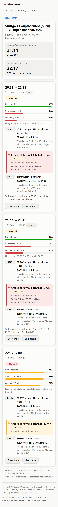
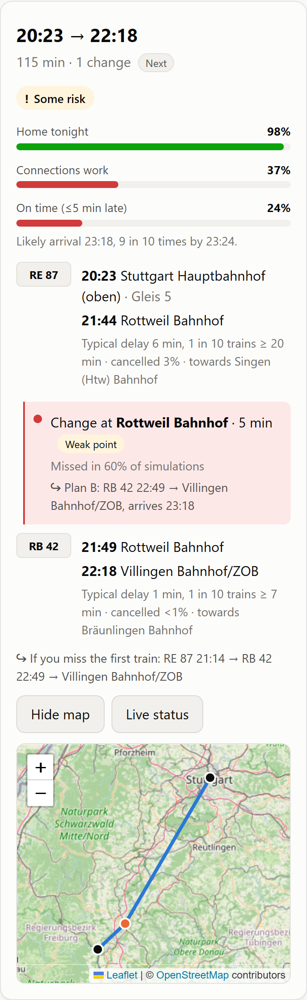
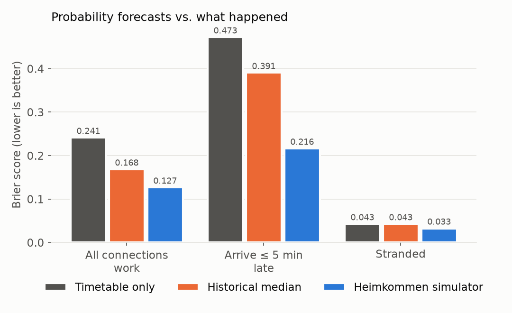
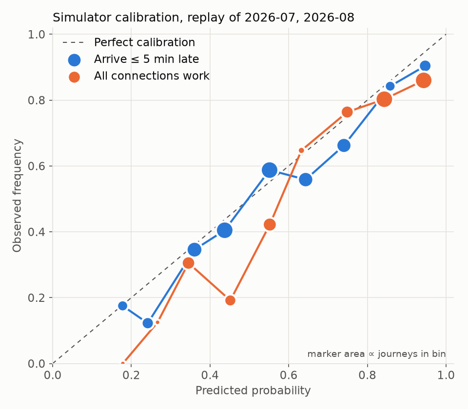
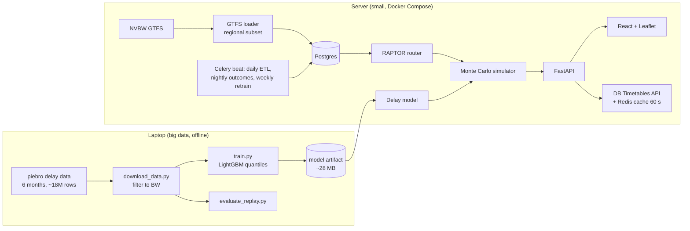

# Heimkommen

**Will I get home tonight?** Heimkommen plans train and bus trips back to the Schwarzwald-Baar-Heuberg region
(Villingen-Schwenningen, Rottweil, Tuttlingen) and tells you *how likely each connection is to work*, based on
six months of real delay data. It also tells you what to do if a connection fails and the latest departure that
still gets you home.

<p align="center">
  
  
</p>

Most journey planners assume every connection works. In July and August 2026, evening journeys home whose tightest
change was 5 minutes or less made all their connections only **27% of the time**. Heimkommen simulates 2,000 evenings per journey with a delay
model trained on real arrival and departure times, including missed connections, rerouting to the next train, and
getting stranded.

## Headline result

Historical replay of **891 real evening journeys** (July–August 2026, months the model never saw): plan with the
timetable, predict, then compare with the actual train times.

| Brier score, lower is better | Timetable only | Historical median delay | **Heimkommen simulator** |
|---|---|---|---|
| All connections work (happened 76%) | 0.241 | 0.168 | **0.127** |
| Arrive ≤ 5 min late (happened 53%) | 0.473 | 0.391 | **0.216** |
| Stranded for the night (happened 4%) | 0.043 | 0.043 | **0.033** |

<p align="center"> </p>

Where it is weaker: the simulator is **optimistic about tight connections**. Changes of ≤ 5 minutes were predicted to
work 38% of the time and actually worked 27% of the time. See [docs/evaluation.md](docs/evaluation.md).

### The last train is often not the one to plan on

Friday evening, Deutschlandticket ([notebook](ml/notebooks/02_last_connections.ipynb)):

| From | To | Last departure | Chance it gets you home | Latest departure that is ≥ 95% safe |
|---|---|---|---|---|
| Stuttgart Hbf | Villingen | 22:17 | 81% | 21:14 |
| Stuttgart Hbf | Donaueschingen | 20:23 | 79% | 19:14 |
| Stuttgart Hbf | St. Georgen | 20:59 | 72% | 19:32 |
| Stuttgart Hbf | Bad Dürrheim | 20:23 | 18% | none |
| Freiburg Hbf | Villingen | 22:42 | 78% | 21:00 |
| Freiburg Hbf | Donaueschingen | 21:00 | 80% | 20:00 |

## What it does

- **Get-home check**: the next journeys with the probability to get home tonight, to arrive on time, and that every
  connection works; the *weak point*; a Plan B for every connection; the latest safe departure and the last
  connection of the night.
- **Deadline planner**: "I need to be in Freiburg by 9:00, 90% sure": walks back from the deadline.
- **Deutschlandticket filter** (no ICE/IC/EC), nearest station from your location, map, live status (DB Timetables API).
- **Accuracy dashboard**: every prediction is logged and matched with what happened by a nightly job.
- Accounts with saved trips; delete everything with one click.

## Architecture



Details: [docs/architecture.md](docs/architecture.md) · API: [docs/api.md](docs/api.md) (and `/docs` on the running
server) · Decisions: [docs/decisions/](docs/decisions/) · Limitations: [docs/assumptions.md](docs/assumptions.md)

## Quickstart (local, no Docker needed)

Requires Python 3.12+ and Node 20+.

```bash
make install            # backend (editable, with dev extras) + frontend deps
make gtfs               # import the NVBW feed from data/bwgesamt.zip (~80 s) into data/heimkommen.db (SQLite)
make stations           # match GTFS stations to DB EVA numbers (needs a delay file, see below)
make api                # http://localhost:8000/docs
make web                # http://localhost:5173
```

The ML pipeline (optional; the app falls back to prior delay distributions without it):

```bash
make delays             # download 6 months of piebro data, keep only BW stations (~4 GB download)
make train              # time-split training, activates the model only if it beats the current one
make evaluate           # historical replay -> ml/artifacts/evaluation.json, docs/img/*.png
```

With Docker: `cp .env.example .env && docker compose up --build` (Postgres, Redis, API, Celery worker + beat,
frontend). Production: `docker-compose.prod.yml` adds Caddy (automatic HTTPS), Prometheus and Grafana; see
[docs/architecture.md](docs/architecture.md#deployment).

## Tests and quality

`make test` runs ruff, mypy, 38 unit/API tests (against a small hand-built GTFS network) and integration tests with
real Postgres and Redis via testcontainers when Docker is available. The frontend is type-checked, linted and built
in CI.

## Windows app

A self-contained Windows version (installer, no login, timetable and model included) is built from
[`desktop/`](desktop/README.md) with `python desktop/build.py`.

## Data sources

Timetable © [NVBW](https://www.nvbw.de/open-data) · delay history from
[piebro/deutsche-bahn-data](https://github.com/piebro/deutsche-bahn-data) (CC BY 4.0, data by Deutsche Bahn) · live
data from the DB Timetables API · map © OpenStreetMap contributors. See [DATA_SOURCES.md](DATA_SOURCES.md).

Heimkommen is an independent student project and **not an official Deutsche Bahn service**. Predictions are
estimates.

## License

MIT, see [LICENSE](LICENSE).
